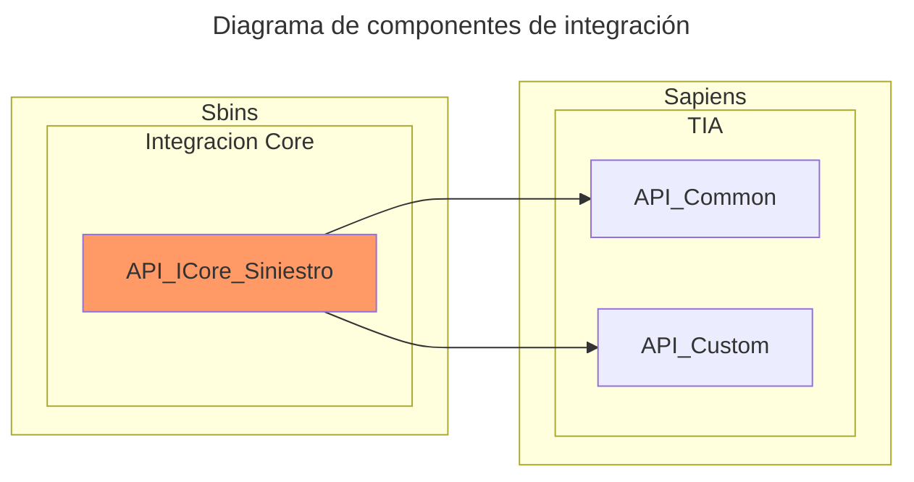

# integracion-core-siniestros-api
API encargada de orquestar, con el nuevo CORE, la creación y obtención de siniestros.

## Documentación
- [Definición de API (Swagger)](http://192.168.10.14/API_IntegracionCoreSiniestros/api-doc/index.html)
- [Instalación y configuración](docs/instalacion.md) 
